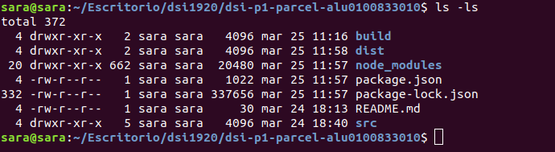
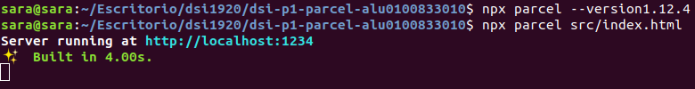
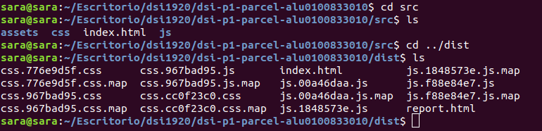
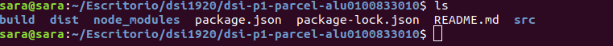
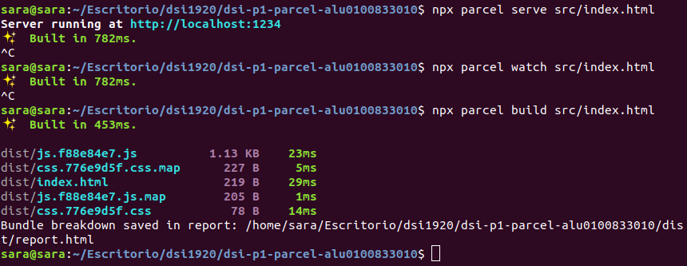
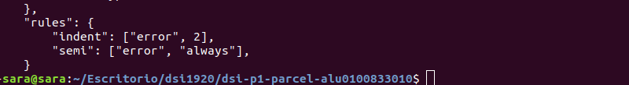

# dsi-p1-parcel-alu0100833010

_Práctica 1. Desarrollo de Sistemas Informáticos._

## Descripción de la Práctica dsi-p1-parcel.

### Tema 1. Parcel y Scaffolding.

El objetivo de esta práctica es tener un repositorio que siga las buenas prácticas vistas en clases, las cuales tendremos que
utilizar de base para las siguientes prácticas que realizaremos. Por lo tanto, lo ideal sería practicar y configurar todo lo 
posible para trabajar cómodamente durante las siguientes semanas en nuestros proyectos.

## Comenzando.

### Automatizadores.

**¿Qué es un automatizador?** Son los encargados de generar la estructura de un proyecto. En esta práctica nos centraremos en el uso del automatizador _Parcel_.

Genera los archivos que son los que va a cargar el navegador. Por un lado tenemos los _archivos fuentes (programador)_, que son los archivos con los que trabajaremos y que el **automatizador** se encargará de leer y realizar las modificaciones oportunas para que se vean en el navegador, creando los _archivos finales (navegador)_.

Nunca debemos tocar los archivos finales, ya que podríamos perder contenido de los archivos fuente.

#### Características de un automatizador.

* Servidor Local Integrado (Live reloading): Se queda escuchando los archivos fuentes y desde que hayan cambios vuelve a generar los archivos finales.
* Soporte para tecnologías avanzadas: Procesadores de CSS, SASS, etc.
* Entorno de desarollo y producción.
* Comodidad.

### Scaffolding.

Es la estructura del proyecto. La estructura que deberá tener nuestro proyecto es la siguiente:

```
  nombre-repo               // Nombre de la carpeta del proyecto.
    |
    +-- dist                // Distribución (archivos finales).              
    +-- src                 // Archivos fuente (archivos editables).
        |
        +-- css             // Carpeta de estilos.
        +-- js              // Carpeta de archivos javascript.
        +-- assets          // Imágenes, fuentes, vídeos, etc (ficheros estáticos).
        |
        index.html          // Código HTML de la página.
    +-- node_modules
    |
    package.json            // Configuración del proyecto.
    package-lock.json       // Información sobre node_modules.
    .gitignore              // Ficheros ignorados por git.
    README.md               // Documentación del repo (markdown).
    .babelrc                // Configuración de Babel.
    .eslintrc.json          // Configuración de ESLint.
    .prettierrc             // Configuración de Prettier.
```
### Pasos para crear un proyecto de 0.

* **Scaffolding** 
  Creamos las carpetas:
  ```
  mkdir -p nombre-repo/src/{css,js,assets}
  ```
  Nos situamos en el repo
  ```
  cd nombre-repo
  ```
* **Git**
  Inicializamos el repo con git:
  ```
  git init
  git remote add origin...
  touch .gitignore
  touch README.md
  ```
* **NPM**
  Inicializamos el repo con npm:
  ```
  npm init -y
  ```
* **Instalar un servidor local**



### Instalación de ParcelJS.

En esta práctica hemos instalado el automatizador _Parcel_ en el proyecto (de forma global daba error).
  ```
  // Instalamos parcel en nuestro proyecto.
  npm install -D parcel-bundler
  
  // Punto de entrada para parcel.
  npx parcel src/index.html
  ```

  
Parcel instala dependencias por si solo.

En la carpeta _dist_ encontramos los ficheros generador por parcel:



Además de la carpeta _dist_, en el entorno de desarrollo, tendremos la carpeta _build_ donde se encuentra los archivos de producción.



Parcel ofrece 3 tipos de funciones:

* Función **serve**: Crea un servidor de desarrollo.
* Función **watch**: Modo sólo watch (si ya existe un servidor).
* Función **build**: Genera los archivos para producción.



### Linters.

Son sistemas que vigilan el código. El linter **ESLint** será el que utilizaremos en nuestra práctica.

  ```
  npm install -D eslint
  ```
En el archivo _.eslintrc.json_ definimos las reglas de ESLint.



#### Formateador de código: Prettier.

  ```
  // Configurar nuestro proyecto para Prettier
  npm install -D prettier
  
  // Plugins para evitar conflictos entre Prettier y ESLint.
  npm install -D eslint-config.prettier eslint-plugin-prettier
  ```
### Retos.
